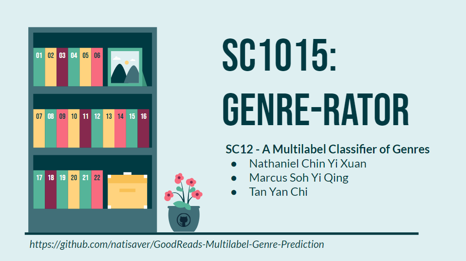
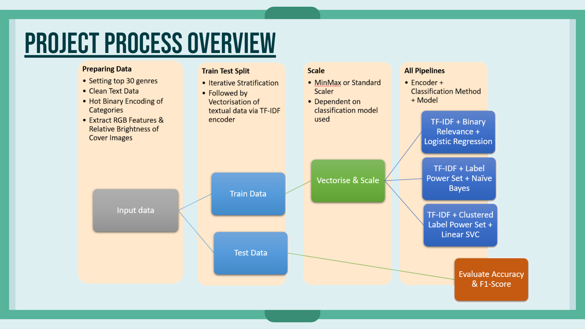

# GoodReads-Multilabel-Genre-Prediction
## A multilabel genre predictor of books for DSAI Project

In this project, we predict the genres (self-curated top 30) that a book can be classified into based on the plot description, brightness (luminance) of cover images and numRatings. The data set is obtained from [Zenodo](https://zenodo.org/record/4265096/files/books_1.Best_Books_Ever.csv?download=1). 



## Table of Contents 
- [Libraries](#libraries)  
- [Files](#jupyter-notebook-files)  
- [Overview](#project-overview)  
  - [Train Test Split & Scaling](#scaling)
  - [Multilabel Classifiers](#multilabel-classifiers)
- [Results](#results) 
- [Things we learnt from the project](#Things-we-learnt-from-the-project) 
- [References](#references)  
- [Contribution](#contribution)

---
## Libraries
Libraries used:
- General: `numpy`, `pandas`, `matplotlib`, `seaborn`, `ast`
- Models & Classifiers: `sklearn`
- Textual Data: `nltk`, `unicodedata` 
- Image Processing: `imageio`, `scipy.cluster.vq`, `PIL`

## Jupyter Notebook Files
1. Data Preprocessing, Scraping & Cleaning [link to ipynb1](https://github.com/natisaver/GoodReads-Multilabel-Genre-Prediction/blob/main/Notebooks/1_Data_Preprocessing.ipynb)
2. Exploratory Analysis [link to ipynb2](https://github.com/natisaver/GoodReads-Multilabel-Genre-Prediction/blob/main/Notebooks/2_EDA.ipynb)
3. Models & Results [link to ipynb3](https://github.com/natisaver/GoodReads-Multilabel-Genre-Prediction/blob/main/Notebooks/3_Modelling.ipynb)

Genre list
```
top30genrelist = ['fiction',
'fantasy',
'romance',
'young adult',
'contemporary',
'adult',
'nonfiction',
'history',
'novels',
'mystery',
'historical fiction',
'audiobook',
'science fiction',
'paranormal',
'literature',
'adventure',
'classics',
'thriller',
'childrens',
'magic',
'humor',
'contemporary romance',
'crime',
'suspense',
'middle grade',
'chick lit',
'biography',
'teen',
'horror',
'philosophy']
```

## Project Overview



  ### Scaling & Split
    
  `IterativeStratification` was used to train test split the data set via the skmultilearn library, which essentially splits each input into subsets (where each label is considered individually) and then it distributes the samples starting with fewest "positive" samples and working up to the inputs that have the most labels.
    
  `MinMax Scaling` was utilised.

  We scale our data because many machine learning algorithms are sensitive to data scales.

  For algorithms such as logistic regression, neural network, etc. that use gradient descent as an optimization technique, scaling helps the gradient descent converge more quickly towards the minima 

  For Distance algorithms like SVM which uses distances between data points to determine their similarity, higher weightage is given to features with higher magnitude.
  
  ### Multilabel Classifiers
  Three techniques are used to classify the movies into various multi-labels:
  * **Binary Relevance**: This consists of fitting one classifier per class, via `OneVsRest`. For each classifier, the class is fitted against all the other classes. The union of all classes that were predicted is taken as the multi-label output. `Logistic Regression` Machine Learning Model was used.

  * **Label Powerset**: In this approach, we transform the multi-label problem to a multi-class problem with 1 multi-class classifier trained on all unique label (genre) combinations found in the training data. Each plot in the test data set is classified into one of these unique combinations. `Naive Bayes` algorithm was used.

  * **Label Powerset with Clustering**: We use clustering technique (`k-means`) to reduce the number of possible classes into a manageable number. `Linear SVC` was then used.


---
## Results
Models were finally evaluated for their `F1-Scores`.

| Pipeline | Precision |  Recall | F1-Score |
| ------------- | ------------- | ------------- | ------------- |
| TF-IDF + Binary Relevance + Logistic Regression  | 0.65  | 0.26  | 0.29 |
| TF-IDF + Label Powerset + Naive Bayes  | 0.58 | 0.42 | 0.43 | 
| TF-IDF + Label Powerset with Clustering + Linear SVC  | 0.29 | 0.26 | 0.27 |

## Things we learnt from the project
-	Web Scraping
-	Image Feature Extraction using Pillows 
-	Textual Analysis: Using NLTK library to clean strings 
-	Multi-Hot Binary Encoding
-	Word Cloud
-	Iterative Stratification for Train-Test Split
-	MinMax Scaling
-	TF-IDF Vectorizer
-	Multi-Label Classification Algorithms: Binary Relevance, Label Powerset, Label Powerset with Clustering
-	Logistic Regression, Naïve Bayes, Linear SVC
-	Concepts of Precision, Recall and F1-Score

## References
- https://realpython.com/image-processing-with-the-python-pillow-library/
- https://www.analyticsvidhya.com/blog/2021/05/how-to-perform-one-hot-encoding-for-multi-categorical-variables/
- https://www.nltk.org/
- https://link.springer.com/content/pdf/10.1007%2F978-3-642-23808-6_10.pdf
- https://towardsdatascience.com/all-about-feature-scaling-bcc0ad75cb35
- https://iksinc.online/tag/tfidfvectorizer/
- https://www.sciencedirect.com/topics/computer-science/logistic-regression#:~:text=Logistic%20regression%20is%20a%20process,%2Fno%2C%20and%20so%20on.
- https://www.analyticsvidhya.com/blog/2017/09/naive-bayes-explained/

## Contribution
Nathaniel: 
-	Extracting RGB using Pillows Library, General Data Cleaning
-	Genre Analysis and Cleaning
-	Genre Distribution 
-	Word Cloud
-	Iterative Stratification (Train/Test Split)
-	Logistic Regression
-	Model Analysis (Precision, Recall, F1-Score)

Marcus: 
-	Web Scraping
-	Multi-Hot Binary Encoding of Genre, General Data Cleaning
-	Genre Analysis and Cleaning
-	Multi-Genre Distribution plot 
-	Min-Max Scaling
-	Linear Support Vector Machine Classifier and K-Means Clustering

Yan Chi: 
-	Cleaning description using NLTK, General Data Cleaning
-	Genre Analysis and Cleaning
-	Heatmap plot
-	Analysing Numerical Variables with respect to genre
-	TF-IDF Vectorizing 
-	Naïve Bayes

---
by Nathaniel, Marcus & Yan Chi
